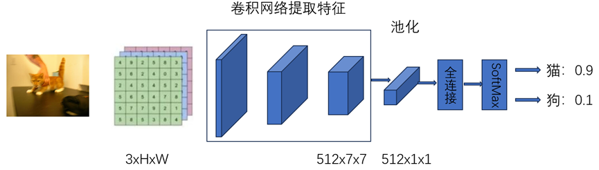

# classification-torch
A simple demo of implementing cat and dog classification 

这个项目是一个简单的使用resnet18实现猫狗分类的例子，主要学习：1）是神经网络实现分类的原理
2）了解模型优化流程：数据处理、损失计算、反向传播等 3）熟悉如何使用torch加载图片数据、搭建模型、训练模型。

## 环境准备
 pip install -r requirement.txt
## 数据集准备
使用Kaggle的猫狗数据集进行分类，该数据集总共25000图片，猫和狗数量各占一半，图片大小不固定。随机挑选1000张猫和1000张狗的图片作为验证集。训练数据放在项目data目录下

Kaggle猫狗数据集下载地址：https://www.microsoft.com/en-us/download/details.aspx?id=54765

## 训练
修改train.py参数，包括训练集路径、测试集路径和图片尺寸等，然后运行脚本

python train.py 

训练日志输出：

## 单张图片测试
修改test.py脚本中图片路径和模型权重路径，然后运行脚本

python test.py 

测试结果：

## 自定义数据集加载、模型
修改dataset.py中的build_data_set定义自己dataset类
修改model.py中的buid_model定义自己的模型
训练时保证模型的类别输出和数据集一样即可